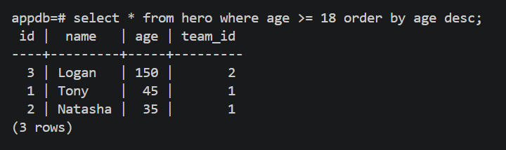
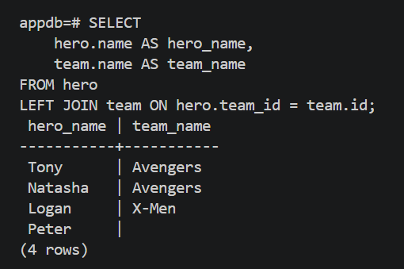
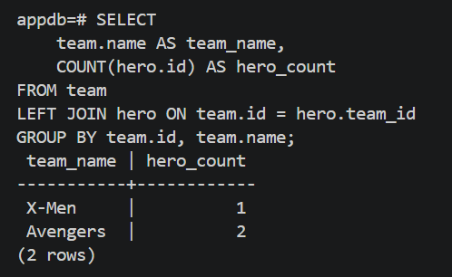
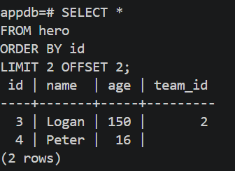
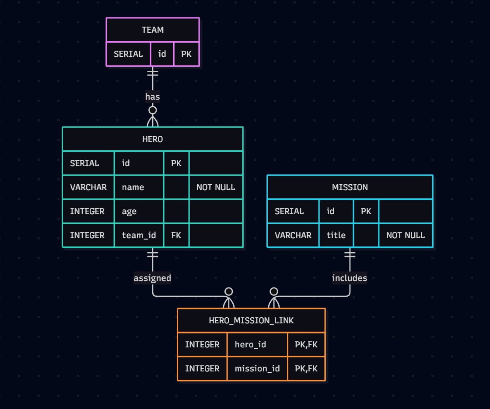

# Answers – Week 9

## Question 1

_4 câu lệnh ở 1.3: ràng buộc nào chặn, vì sao?_

1.  

2.  

3.  

4.  

## Question 2

_Vì sao FK nằm ở hero chứ không phải team?_

trong mối quan hệ 1\*, một đội có nhiều anh hùng nhưng mỗi anh hùng chỉ thuộc về tối đa 1 đội

## Question 3

_Sơ đồ bảng many-to-many hero–mission_

## Question 4

_Vì sao đọc URL từ biến môi trường? (2 lý do)_

- vì vấn đề bảo mật
- flex, có thể dễ dàng chỉnh sửa biến trong môi trường khi thay đổi thông tin db

## Question 5

_Vì sao id là int | None, default=None?_

- khi lưu vào db, db tự động tạo stt và gán giá trị nguyên
- = None cho phép tạo entity mới mà không cần gán giá trị

## Question 6

_Thuộc tính nào của Hero là cột, cái nào không? back_populates để làm gì?_

- các thuộc tính trở thành cột: id, name, age, secret_name, team_id
- không trở thành cột: team
- back_populates: thiết lập và đồng bộ mối quan hệ 2 chiều giữa các model trong python.

## Question 7

_So sánh CREATE TABLE hero của SQLAlchemy với bản viết tay_

- bản viết tay sử dụng kiểu số tự tăng: SERIAL PRIMARY KEY
- còn SQLAlchemy sinh ra cú pháp chuẩn SQL: INTEGER GENERATED BY DEFAULT AS IDENTITY
- SQLAlchemy có câu lệnh tạo index riêng
- Cột mới: SQLAlchemy sinh thêm cột secret_name VARCHAR NOT NULL

## Question 8

_Restart server có in CREATE TABLE lại không? create_all làm gì khi bảng đã tồn tại?_

- không
- create_all: nó sẽ bỏ qua hoàn toàn và không can thiệp, thay đổi cấu trúc bảng

## Question 9

_Dòng nào trong main.py đăng ký Hero và Team?_

- các dòng lệnh import như: from app.models import...

## Question 10

_Bỏ commit() thì response và DB ra sao? add() và refresh() làm gì?_

- session.commit() bị bỏ -> API trả về lỗi hoặc id null vì db chưa bao giờ sinh ID, DB: không có bản ghi nào vào bảng hero khi kiểm tra bằng select \*
- add(): đưa đối tượng vào trạng thái theo dõi của seasion, chuẩn bị cho câu lệnh INSERT
- refresh(): gửi truy vấn đọc lại dl mới nhất từ db, giúp db load được những dl vừa mới update hoặc tự sinh

## Question 11

_SQL nào được in ra cho PATCH {"age": 17}? Update mọi cột hay chỉ age?_

- UPDATE hero SET age=%(age)s WHERE hero.id = %(hero_id)s
- update duy nhất cột age

## Question 12

_secret_name có trong JSON không? Dòng code nào chịu trách nhiệm?_

- không có trong json
- dong code: response_model=HeroPublic

## Question 13

_Giá trị 18 và 1 xuất hiện ở đâu trong SELECT? Vì sao an toàn trước SQL injection?_

- Vị trí xuất hiện: Các giá trị 18 và 1 không được nối chuỗi trực tiếp vào văn bản SQL mà xuất hiện dưới dạng tham số thay thế/placeholde. Các giá trị thực tế nằm trong dictionary tham số truyền kèm: {'age_1': 18, 'team_id_1': 1}.

- khả năng phòng chống SQL Injection: Do sử dụng cơ chế Parameterized Queries (Prepared Statements). Database driver gửi riêng biệt mã lệnh SQL và dữ liệu tham số; hệ quản trị database xử lý các tham số thuần túy dưới dạng giá trị/dữ liệu văn bản chứ không bao giờ biên dịch chúng thành mã lệnh thực thi.

## Question 14

_Vì sao lọc trong DB thay vì lọc trong Python?_

- Lọc tại cơ sở dữ liệu chỉ gửi đúng những bản ghi cần thiết qua đường truyền mạng về ứng dụng.
- Có thể tối ưu hóa bằng index

## Question 15

_Quy tắc của create_all với bảng mới / bảng đã có?_

- Quy tắc: create_all hoạt động theo nguyên lý "Create If Not Exists".

- Nó thực hiện truy vấn schema của database trước: nếu bảng chưa tồn tại, sẽ thực hiện lệnh create table, nếu tồn tại thì sẽ bỏ qua.

## Question 16

_Thứ tự INSERT trong seed và hero.team_id lấy giá trị từ đâu?_

- Các bản ghi của bảng team được INSERT trước, sau đó mới đến các bản ghi của bảng hero
- Do sử dụng gán đối tượng quan hệ, SQLModel/SQLAlchemy tự động theo dõi phụ thuộc. Nó lưu đội Avengers trước để cơ sở dữ liệu sinh khóa chính id, sau đó tự lấy giá trị id vừa sinh này điền vào trường khóa ngoại team_id của đối tượng hero trước khi thực hiện câu lệnh INSERT INTO hero.

## Question 17

_Có cột power không? GET /heroes xảy ra gì? Vì sao không drop all + create_all?_

- Không có cột power trong bảng hero vì create_all bỏ qua bảng đã tồn tại và không có khả năng tự thay đổi schema của bảng cũ.

- bị lỗi 500 Internal Server Error do SQLAlchemy sinh câu lệnh SELECT cố gắng đọc cột power.

- Thao tác drop bảng sẽ xóa sạch toàn bộ dữ liệu đang có của hệ thống và người dùng. Việc này gây mất mát dữ liệu vĩnh viễn và làm gián đoạn dịch vụ nghiêm trọng.

## Question 18

_upgrade() và downgrade() làm gì?_

- upgrade(): Chứa các chỉ thị chuyển tiếp (như op.add_column('hero', sa.Column('power', ...))) để áp dụng những thay đổi mới vào cấu trúc bảng hiện tại trong database khi nâng cấp lên phiên bản migration này.

- downgrade(): Chứa các thao tác đảo ngược lại chính xác những gì upgrade() đã làm (như op.drop_column('hero', 'power')), cho phép hoàn tác (rollback) database về trạng thái ngay trước đó khi cần sửa chữa lỗi.

## Question 19

_Alembic lưu revision hiện tại ở đâu? Vì sao commit migrations/ lên Git?_

- alembic lưu ID của phiên bản hiện tại trong một bảng riêng biệt tự động tạo tên là alembic_version trong database
- Giúp đồng bộ hóa lịch sử thay đổi schema cơ sở dữ liệu giữa tất cả thành viên trong nhóm phát triển.
- Cho phép các môi trường triển khai (CI/CD, Staging, Production) có thể chạy lệnh alembic upgrade head để cập nhật đồng nhất cấu trúc database theo đúng phiên bản mã nguồn

## Question 20

_Đổi tên secret_name -> alias: Alembic sinh gì? Nguy hiểm thế nào? Sửa ra sao?_

- Alembic sinh ra: Cơ chế so sánh tự động (autogenerate) không nhận biết được thao tác đổi tên, nên nó sẽ tạo ra hai lệnh tách biệt: một lệnh xóa cột cũ và một lệnh xóa cột mới.

- Nguy cơ: Cực kỳ nguy hiểm vì toàn bộ dữ liệu hiện có trong cột secret_name sẽ bị xóa hoàn toàn không thể khôi phục.

- Cách khắc phục: Chỉnh sửa file migration thủ công trước khi chạy áp dụng. Thay thế hai lệnh drop_column / add_column bằng lệnh đổi tên cột duy nhất của Alembic:
  - Trong upgrade(): op.alter_column('hero', 'secret_name', new_column_name='alias')
  - Trong downgrade(): op.alter_column('hero', 'alias', new_column_name='secret_name')
